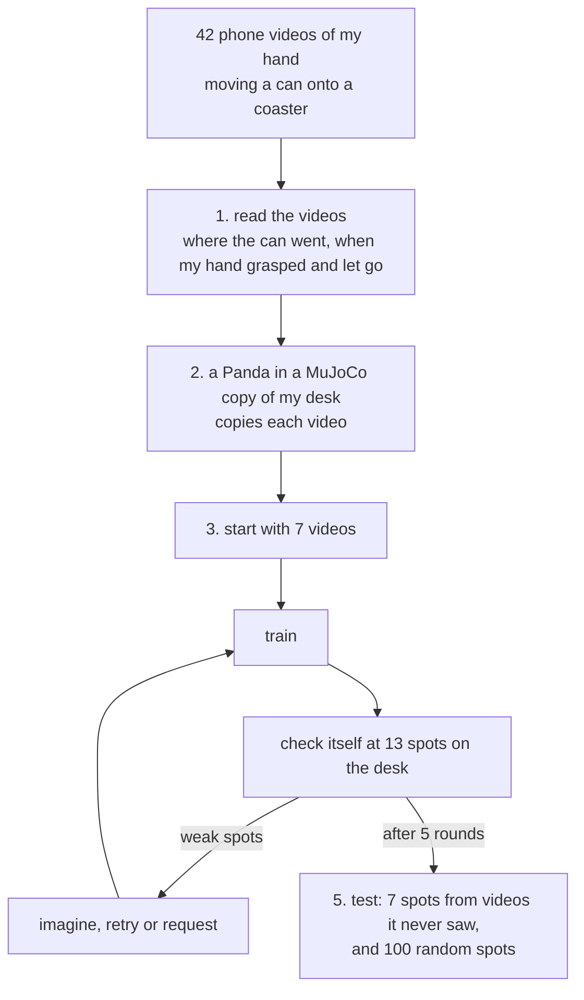

# Request or Retry

I filmed my hand putting an energy-drink can on a coaster, 42 times, with my phone. This project turns those videos
into a robot that does the same job in simulation, and learns it from as few of my videos as possible.

The robot starts with 7 videos. It checks itself all over the desk, and wherever it still fails it picks the cheapest
help that works: **imagine** the attempt with its world model (free), **retry** with the arm (robot time), or
**request** one more video from me (my time).


## At a glance

- **It learns the task from my videos.** At 7 spots taken from videos it never saw, it succeeds 74% of the time,
  close to the 78% it gets from all 33 training videos at once, while using only 9 of them.
- **It works anywhere on the desk.** At 100 random spots it succeeds 96% of the time, and 97% when it finds the can
  with its own camera instead of being told where it is.
- **It saves both kinds of help.** It needs fewer of my videos than always asking for one, and less robot time than
  always practising.
- **Its world model knows where it can be trusted.** It replaced 79 checks with the arm, and was right 97% of the time.

| what the brief asks for | where it is here |
|---|---|
| your own data drives a robot arm in simulation | [1. Reading my videos](#1-reading-my-videos), [2. The robot copies my videos](#2-the-robot-copies-my-videos) |
| VLA and/or world models | [4. The world model](#4-the-world-model) |
| post-training, bootstrapping and RL | [3. Learning from 7 videos](#3-learning-from-7-videos-and-asking-for-help-only-where-needed) |
| creative retargeting, other embodiments | [2. The robot copies my videos](#2-the-robot-copies-my-videos) |
| a faster policy | [Speed](#speed) |
| how to run it, design choices, what worked | [Try it](#try-it), [Design choices](#design-choices), [What worked](#what-worked-and-what-didnt), [Reproduce everything](#reproduce-everything) |

## Try it

Tested on Ubuntu with Python 3.14. Installing takes a few minutes; a GPU isn't needed to watch the robot or to rerun
the experiments.

```bash
git clone https://github.com/anspermiranda/request_or_retry_learning.git
cd request_or_retry_learning
git clone --depth 1 --filter=blob:none --sparse https://github.com/google-deepmind/mujoco_menagerie.git
(cd mujoco_menagerie && git sparse-checkout set franka_emika_panda)
python3 -m venv .venv
source .venv/bin/activate
pip install -r requirements.txt
```

The measurements from my videos (`out/`) and the trained robot (`results/*.pkl`) are in the repository, so you can
watch it straight away:

```bash
python watch.py IMG_8697 --viewer   # an exam spot, live in the MuJoCo window (close it to go on)
python watch.py --exam              # the 7 exam spots, my video next to the robot
python watch.py --train             # the 7 spots it started learning from
python watch.py IMG_8682 --copy     # the robot copying one of my videos directly
python watch.py IMG_8697 --eye      # the robot finding the can with its own camera
```

In every video my path is yellow and the robot's is green. My own videos appear on the left once they're downloaded
(see [Reproduce everything](#reproduce-everything)).

## How it works



### 1. Reading my videos

`calibrate_camera.py`, `read_demos.py`


The phone is calibrated with a checkerboard video, and a paper marker (ArUco) on the desk gives real centimetres. In
each video, YOLOE finds the can by name ("energy drink can"), SAM 2 follows its outline in every frame (blue), and
MediaPipe tracks 21 points on my hand (pink). From these I get the can's 3D path, and the moments my hand grasped,
lifted, set down and let go. A bird's-eye view of the desk gives the coaster and the other objects. 40 of the 42
videos are usable.

Here's what each measurement is used for:

| from my videos | used for |
|---|---|
| where the can starts | where the can is put in the simulator, and which video the robot gets when it asks for one |
| the can's 3D path | the path the robot carries the can along |
| when my hand grasps and lets go | when the gripper closes and opens |
| the coaster | where the can has to end up: the reward |
| the other objects | obstacles in the simulator: touching one makes the attempt fail |
| the can's size and colour | the can in the simulator, and how the robot's own camera finds it |
| where my phone was | a camera in the simulator at the same place, for the side-by-side videos |

### 2. The robot copies my videos

`twin.py`, `retarget.py`

The simulator is a MuJoCo copy of my desk, with a Franka Panda standing where I sat. The robot can't copy my hand's
shape with a two-finger gripper, so it copies two things instead: **when** I grasped and let go (from my hand), and
**where** the can went (from the can). It grasps from the top, carries the can along my path with my timing, sets it
down where I did and lets go. Wherever my path passed over an object, the robot carries the can at least 2 cm above
it, because it can't see the object the way I could.

**39 of my 40 videos become robot demos.** Each one gives four: an exact copy, and three with small random pushes, so
the robot also learns how to get back on track. The one that fails, IMG_8710, starts so close to the robot's base
that its elbow hits its limit.

**A different body position.** Standing the same robot at the right side of the desk instead, only 23 of the 40
videos can be copied: the far-left ones are out of reach. Which of my videos are useful depends on the robot.

### 3. Learning from 7 videos, and asking for help only where needed

`policy.py`, `agent.py`, `experiment.py`

I split my videos into three groups: **7 to start with**, **7 for the exam** (never used for training), and **26 in
a pile**. In real life I'd film a new video when the robot asks for one; to keep the experiment repeatable I filmed
them all in advance, and a request gets the pile video whose can starts closest to the weak spot (within 10 cm).

The robot's policy is a small diffusion policy, trained from scratch. It sees where the can and the coaster are
relative to its gripper, never where on the desk it is, so it can't just memorise spots. Then, for 5 rounds:

1. **Train** on everything it has so far.
2. **Check itself** at 13 practice spots across the desk (2 tries each). These are its own checks, kept away from the
   exam spots.
3. **Get help** at its 4 weakest spots, cheapest first:

| | what happens | cost | when |
|---|---|---|---|
| **imagine** | it tries the spot inside its world model, using its closest video moved to that spot, and learns from it if the model predicts success | free | the world model has already been right at that spot |
| **retry** | it practises at the spot with the arm: once by replaying the closest video it already has, moved to that spot, and 5 times with its own policy. It learns from the attempts that worked | robot time | it has a video starting within 10 cm, or it already succeeds there sometimes |
| **request** | it asks me for a new video near that spot | my time | otherwise |

Every method is charged the same way: about 30 s of my time per video (from the gaps between my recordings), and for
the robot, every real attempt plus 20 s to put the can back. Here's my run, in the first and the last round:

 

*Each circle is a practice spot with its success %. Green: fine. Orange: practised. Blue: imagined. Red: asked for a
video. Purple: no video close enough. A cyan ring means the world model is trusted there; X marks an exam spot.*

### 4. The world model

`world_model.py`

Every real attempt costs robot time and someone resetting the can, so the robot also learns to predict the result
instead. The world model is five small networks that predict the next 0.1 s (where the gripper, the fingers and the
can will be) from the current state and the move. They learn from everything the arm has really done so far, and are
retrained every round.

A world model is only useful where it's right, so **trust is earned spot by spot**: the robot relies on it at a spot
only after it predicted every real attempt there correctly. The model can't see the objects on the desk, and trust is
what keeps the robot from relying on it near them.

| on attempts it never saw | |
|---|---|
| success or failure predicted correctly | 83% (87% at trusted spots, 80% elsewhere) |
| can position error 1 s and 2 s ahead, predicting on its own | 0.3 cm and 0.4 cm |
| checks done in its head instead of with the arm | 79, right 97% of the time |
| imagined attempts it learned from | 4, all of which really worked in physics |


### 5. Testing it

`experiment.py`, `evaluate.py`, `desk_test.py`

An attempt counts only if the can ends upright on the coaster, the gripper has let go, and nothing else on the desk
was touched. My path isn't compared; any path is fine. The robot is tested in two ways, and neither is ever used for
learning:

- **7 exam spots:** where the cans start in the 7 videos it never saw, 10 tries each with the can nudged by about 1 cm.
- **100 random spots** anywhere in the area my videos cover, once told where the can is, and once finding the can with
  its own colour + depth camera.

## Results

| on the 7 exam spots (70 tries; average of 3 runs) | success | my videos it needed | robot minutes |
|---|---|---|---|
| start: my 7 videos, no help yet | 65% | 7 | 16 |
| **imagine → retry → request (mine)** | **74%** | **9** | **87** |
| always ask me for a video | 72% | 13.3 | 103 |
| always practise | 74% | 7 | 133 |
| 2 random videos per round | 69% | 17 | 115 |
| collect all 33 videos up front | 78% | 33 | about 75 |

My robot matches the best of the round-by-round methods with the least help: always practising needed 53% more robot
time, and always asking needed 6 extra videos instead of 2 and still ended lower. It also ends within 4 points of
collecting all 33 videos up front. It only asks when practice can't fix a spot: starting from my 7 videos it never
asked at all, and from two random sets of 7 it asked for 3 videos each. Differences of a few points are within noise
(210 tries per method).


At a spot it never saw (my video of that spot on the left):


### Anywhere on the desk

This is the robot from my run, which learned from my 7 videos and its own practice:


| 100 random spots, one try each | success |
|---|---|
| **my robot, finding the can with its own camera** | **97%** (its estimate is 0.6 cm off on average) |
| my robot, told where the can is | 96% |
| trained on all 33 videos up front, told where the can is | 97% |

31 of these spots are more than 10 cm from where any of its videos starts, and it still succeeds at 90% of them. The
few failures are scattered: tipped over, touched the book or the charger, missed the coaster.
[All three versions side by side](results/desk_map_compare.png).

### Where it fails

| exam video | distance from the robot's base | start | mine | all videos |
|---|---|---|---|---|
| IMG_8697 | 63 cm | 93% | 100% | 93% |
| IMG_8684 | 31 cm | 63% | 93% | 100% |
| IMG_8693 | 71 cm | 100% | 100% | 100% |
| IMG_8689 | 47 cm | 70% | 97% | 100% |
| IMG_8694 | 28 cm | 0% | 17% | 30% |
| IMG_8704 | 44 cm | 90% | 97% | 100% |
| IMG_8710 | 27 cm | 40% | 17% | 20% |

On 5 of the 7 exam spots it succeeds 97% of the time. The other two are right next to the robot's base, where none of
my videos starts (the closest is 32 cm away) and where the robot can't even copy my own video of IMG_8710. Every
method struggles there, even with all 33 videos. That's also why the exam average (74%) is lower than the random
spots (96%). More detail, including every failure, is in [results/evaluation.md](results/evaluation.md).

### Speed

`speed.py`

| the same final policy | network passes per decision | ms per decision (CPU) | exam |
|---|---|---|---|
| diffusion, standard (DDPM, 100 steps) | 100 | 6.04 | 73% |
| diffusion, DDIM 10 steps | 10 | 0.39 | 76% |
| **diffusion, DDIM 4 steps (what the robot uses)** | 4 | **0.16 (37× faster)** | **76%** |
| a student distilled into 1 pass | 1 | 0.01 (519× faster) | 41% |
| behaviour cloning on the same data | 3 | 0.04 | 46% |

The policy predicts clean moves rather than noise, which is what keeps 4 steps as good as 100.

## Design choices

**Copy the can, not the hand.** A two-finger gripper can't use a human hand's pose, but it can do what the can did.
My hand still matters: it says when to close and when to let go.

**Make it impossible to memorise.** The policy only sees where things are relative to its gripper. That's why it
works at spots it has never seen, including 90% of random spots far from all its videos.

**Count every cost the same way.** The whole point is spending less of my time and less robot time, so every method
pays the same price per video and per attempt, and they all draw from the same pile of videos.

**Keep the RL simple.** With a 0/1 reward, practice keeps the attempts that succeeded and trains on them (filtered
behaviour cloning, the simplest reward-weighted regression). Every practice attempt costs 30–45 s with the reset, far
too few for something like PPO.

**A world model that has to earn trust.** Imagination is only free if it's right. Measuring trust spot by spot let the
robot skip 79 real checks safely and stay away from the places the model can't see.

**Why not SmolVLA.** I chose the world-model route. A VLA like SmolVLA needs about 50 demos (its guide says 25 weren't
enough), while my robot starts from 7 on purpose, and it would have to be retrained 72 times across the experiment at
hours per run. The robot demos made from my videos are exactly the data a VLA is fine-tuned on, so that's the natural
next step.

**Where the idea comes from.** The closest work I know is Rigter, Lacerda & Hawes, where a robot chooses between asking
a person to teleoperate it and acting on its own. Here there's a free first step (the world model), the help is a phone
video rather than teleoperation, and both my time and robot time are counted.

## What worked and what didn't

**Worked**
- Copying the can instead of the hand: 39 of 40 videos became robot demos.
- The 2 cm safety margin. Without it, the carried can touched objects in 4 of 35 exam tries and my robot scored 59%;
  with it, no touches and 74%.
- Practice: the robot's own successful attempts helped as much as extra videos, without costing my time.
- The diffusion policy: 76%, against 46% for plain behaviour cloning on the same data.

**Didn't**
- Plain behaviour cloning. It copied its own last gripper command and blurred the grasp and the release; fixes helped,
  but it stayed far behind.
- Squeezing the policy into one network pass (41%): fast, but it blurs closing and letting go.
- The two spots next to the robot's base. None of my videos starts that close.
- My first evaluation only checked the arm for collisions, not the can it carries. Every method looked the same
  (70–72%). Checking both showed the real differences.

## Reproduce everything

Everything below runs on a laptop. Only reading the videos benefits from a GPU.

**1. Set up** as in [Try it](#try-it).

**2. Download my videos** from the [dataset release](https://github.com/anspermiranda/request_or_retry_learning/releases/tag/dataset-v1):

```bash
mkdir -p data/demos data/calibration
for i in $(seq 8682 8723); do
  curl -L -o data/demos/IMG_$i.MOV https://github.com/anspermiranda/request_or_retry_learning/releases/download/dataset-v1/IMG_$i.MOV
done
curl -L -o data/calibration/checkerboard.MOV https://github.com/anspermiranda/request_or_retry_learning/releases/download/dataset-v1/checkerboard.MOV
```

**3. Read the videos** (optional: the results are already in `out/`). The YOLOE, SAM 2 and MediaPipe models download
themselves the first time.

```bash
python calibrate_camera.py data/calibration/checkerboard.MOV   # -> calibration.json
python read_demos.py data/demos                                # -> out/<clip>/ (about 2 h with a GPU)
python collect_results.py                                      # -> out/results_table.csv, a quality check per video
python make_splits.py --start IMG_8682 IMG_8688 IMG_8690 IMG_8703 IMG_8707 IMG_8718 IMG_8723   # -> data/splits.json
```

**4. Run everything else** with one command (about 1 hour on a 16-thread laptop):

```bash
bash run_all.sh
```

Or step by step:

| command | what it does | writes |
|---|---|---|
| `python retarget.py` | the robot copies every video | `sim/`, the robot demos |
| `python retarget.py --base 0.35 -0.10` | the same with the robot moved to the right side | `sim_base/` |
| `python experiment.py` | all methods, 3 runs, 5 rounds each (about 40 min) | `results/summary.json`, maps, curves, trained policies |
| `python evaluate.py` | the final robot in detail, with its own camera too | `results/evaluation.md` |
| `python desk_test.py` | the final robot at 100 random spots | `results/desk_map.png` |
| `python speed.py` | the same policy run faster | `results/speed.json` |
| `python watch.py --exam --save --no-window` | my video next to the robot at every exam spot | `results/watch_*.mp4` |
| `python make_gif.py <video> <gif>` | a GIF for this page | `docs/` |

## Files

| file | |
|---|---|
| `calibrate_camera.py` | the phone's camera, from a checkerboard video |
| `read_demos.py` | my videos → the can's 3D path, grasp and release, annotated videos |
| `collect_results.py` | a quality table for all videos |
| `make_splits.py` | start / exam / pile |
| `twin.py` | the copy of my desk, the Panda, and the task as an RL environment (`reset()`, `step()`) |
| `retarget.py` | my videos → robot demos |
| `policy.py` | the diffusion policy, and behaviour cloning for comparison |
| `world_model.py` | the world model and where to trust it |
| `agent.py` | the robot that chooses imagine, retry or request |
| `experiment.py` | the comparison between methods |
| `evaluate.py`, `desk_test.py` | the final robot at the exam spots and at random spots |
| `camera.py` | the robot's own camera, and drawing the side-by-side videos |
| `speed.py` | the faster policy |
| `watch.py` | my video next to the robot, and the live MuJoCo window |
| `make_gif.py` | GIFs for this page |
| `run_all.sh` | everything after reading the videos, in order |

## Related work

- Diffusion Policy (Chi et al., 2023); DDIM (Song et al., 2021); ACT (Zhao et al., 2023) for planning several moves
- DART (Laskey et al., 2017) for the pushes during demos; MimicGen (Mandlekar et al., 2023) for moving demos to new spots
- Reward-weighted regression (Peters & Schaal, 2007)
- Rigter, Lacerda & Hawes, A Framework for Learning from Demonstration with Minimal Human Effort; ThriftyDAgger
  (Hoque et al., 2021)
- PETS (Chua et al., 2018) and MBPO (Janner et al., 2019) for ensembles of learned world models
- YOLOE, SAM 2 and MediaPipe for reading the videos; MuJoCo, MuJoCo Menagerie and mink for the simulation
