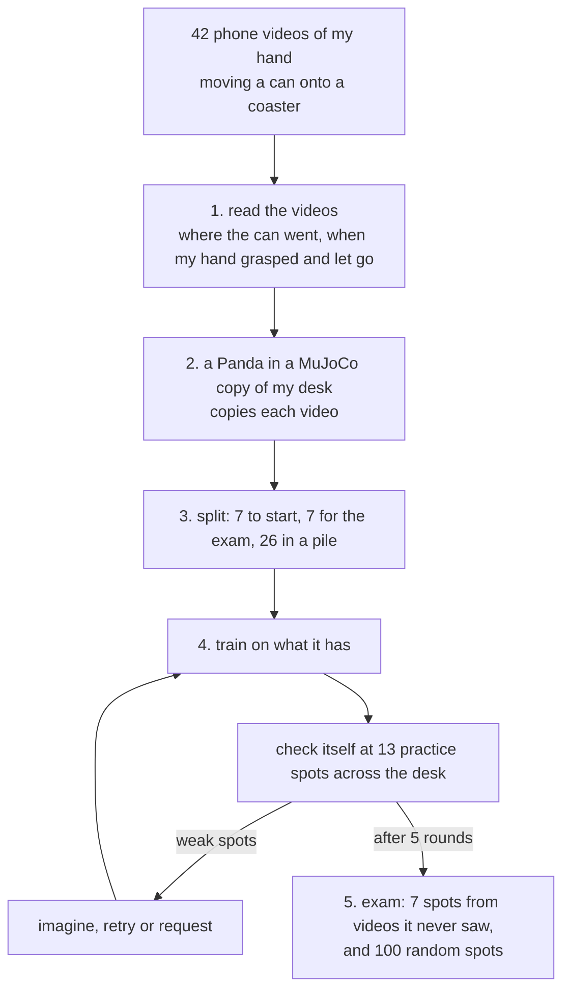

# Request or Retry

**A robot arm learns to put a can on a coaster from my phone videos. It starts with 7 videos, checks itself at 13
practice spots across the desk, and fixes each weak spot with the cheapest help that works: imagine it (free),
practise it (robot time), or ask me for one more video (my time). Then it is tested at 7 spots from videos it never
saw, and at 100 random spots on the desk.**


| exam: 7 spots from videos it never saw (70 tries, average of 3 runs) | success | my videos used | robot minutes |
|---|---|---|---|
| **mine: imagine → retry → request** | **74%** | **9** | **87** |
| always ask for a video (request only) | 72% | 13.3 | 103 |
| always practise (retry only) | 74% | 7 | 133 |
| all 33 videos at the start, trained once | 78% | 33 | about 75 (estimate) |

- **success:** the can ends upright on the coaster, the gripper has let go, and nothing else on the desk was touched.
- **my videos used:** the 7 it starts with, plus the ones it asked me for.
- **robot minutes:** how long the arm is busy: turning each video into robot demos, checking itself and practising,
  plus 20 s to put the can back after every attempt.
- **3 runs:** one starts from my 7 videos, the other two from 7 picked at random.
- **all 33 videos at the start:** the upper bound. It gets every video it could ever ask for and trains on them once,
  so it never needs to ask or practise.

Mine gets 74%, close to the 78% from all 33 videos, but needs only 9 of them. Practising alone also gets 74%, but
takes 133 robot minutes to my 87.

The exam is harder than the random spots. 2 of its 7 spots are right next to the robot's base, closer than any video
it can learn from, and every method fails there most of the time (see [Where it fails](#where-it-fails-and-why)). On
the other 5, mine succeeds 97% of the time. At 100 random spots on the desk, the robot from my run succeeds 96%, and
97% when it finds the can with its own camera (see [Anywhere on the desk](#anywhere-on-the-desk)).

## What I built

Everything here starts from my own phone videos:

- 42 videos of my hand moving a can onto a coaster, read with YOLOE, SAM 2 and MediaPipe into the can's 3D path and
  the moments my hand grasps and lets go
- a MuJoCo copy of my desk, where a Franka Panda copies each video; the same video also works from new start spots,
  and I test what changes when the robot stands somewhere else
- a small diffusion policy bootstrapped from 7 videos, then trained further every round on what it collects;
  practising and keeping the attempts that earned the reward is the RL part
- a world model used as a learned simulator: trained only on what the arm really did, it lets the robot check itself
  and imagine new demos without the arm, at the spots where it has proven right
- a robot that works out where it needs a new video before asking me for one
- a version of the policy that decides 37× faster with the same success

All the learning is plain NumPy and runs on a laptop CPU.

## The idea

A robot can learn a task from videos of a person doing it. But every video costs the person's time, and every practice
attempt costs the robot's time (and someone has to put the can back). So instead of collecting many videos up front, I
give the robot a few, let it find out where on the desk it still fails, and let it pick the cheapest help for each
weak spot:

| | help | cost | used when |
|---|---|---|---|
| 1 | **imagine**: practise in its head. It replays the closest video it already has, moved to start at this spot, inside the world model it learned, and trains on it if the model predicts success | nothing | the world model has already been right at that spot |
| 2 | **retry**: practise with the arm. Once with the closest video it already has, moved to start at this spot, and 5 times with its own policy; it learns from the attempts that worked | robot time | it has something to build on: one of the videos it already has starts within 10 cm, or it already succeeds there sometimes |
| 3 | **request**: ask me for a new video, one that starts near this spot | my time | nothing to build on, or practice didn't work |

Imagine and retry only re-use videos the robot already has. A request is the only way it gets a new one.

## How it works



### Step 1. Read my videos

`calibrate_camera.py`, `read_demos.py`


- **Real centimetres.** The phone is calibrated with a checkerboard video, and a paper marker (ArUco) on the desk
  gives the desk's coordinates. The phone's position is measured again in every clip, so a bumped phone doesn't matter.
- **The can.** YOLOE finds it by name ("energy drink can") in the first frame. SAM 2 then follows its outline in every
  frame (blue), even when my hand covers part of it.
- **My hand.** MediaPipe tracks 21 points on my hand in every frame (pink). The hand is cut out of the can's outline
  before measuring.
- **The coaster** is found by its round shape in a bird's-eye view of the desk (green ring). The other objects on the
  desk are measured in the same view.
- **The 3D path.** While the can stands on the desk, its position comes from where it touches the desk. While it's
  carried, it comes from a real-size can model fitted to its outline. The two agree within 0.1–2.3 cm at rest.
- **The moments.** From my hand and the can's motion: when I grasp, lift, set down and let go.

40 of my 42 videos are usable. IMG_8715 never really moves the can, and IMG_8700's measurement failed its own check.

**How each measurement is used:**

| from my videos | used for |
|---|---|
| where the can starts | where the can is put in the simulator; which video the robot gets when it asks; the exam spots |
| the can's 3D path | the path the robot carries the can along |
| when my hand grasps and lets go | when the gripper closes and opens |
| the coaster | where the can has to end up: the reward |
| the other objects | obstacles in the simulator: touching one makes the attempt fail |
| where my phone was | a camera in the simulator at the same place, for the side-by-side videos |

The can's size comes from a ruler, not the videos. The can in the simulator has my can's light blue, which is how the
robot's own camera finds it.

### Step 2. The robot copies each video

`twin.py`, `retarget.py`

- **The desk.** A MuJoCo copy of my desk: the coaster, laptop, book and the other objects are where my videos show
  them, and a Franka Panda (from MuJoCo Menagerie) stands where I sat. It works like a Gym environment, with `reset()`
  and `step()`.
- **Timing from my hand, path from the can.** The 21 points on my hand tell the robot when I grasped and when I let
  go; the can's path tells it where to carry the can. It doesn't copy my hand's shape: a two-finger gripper can't use
  my fingers and wrist, so it always grasps from the top, at the same height on the can. So it reaches the can where it
  stood, closes when my hand closed, carries it along my path with my timing (1.5× slower), sets it down where I did
  and lets go.
- **Each video becomes a controller.** At every step it looks at where the can really is: it goes to the can wherever
  it stands, tries again if the grasp misses, and carries it along my path point by point. So the same video also
  works when the can is nudged, inside the world model, and from a different start spot: my path is shifted to start
  there, and the shift fades out along the way, so it still ends on the coaster. That's how one of my videos can help
  at a weak spot nearby.
- **Pushes.** Each video gives up to 4 demos: an exact copy, and three with small random pushes along the way, so the
  robot also sees how to get back on track. Only copies that work are kept.
- **A safety margin.** My hand passed just over the desk hub and the glasses case because I could see them. The robot
  can't, so wherever my path goes over an object it carries the can at least 2 cm above it.
- **Result.** 39 of my 40 videos become robot demos. The one that fails, IMG_8710, starts very close to the robot's
  base, and its copy times out without moving the can.
- **Where the robot stands matters.** Standing at the right side of the desk instead
  (`retarget.py --base 0.35 -0.10`), the same robot can copy only 23 of the 40 videos: most of the others start too
  far to the left for it to reach, and 3 start too close to it. Which of my videos are useful depends on the robot's
  body and where it stands.

`python watch.py IMG_8682 --copy --viewer` plays a copy live in the MuJoCo window, with my path in yellow and the
robot's in green.

### Step 3. Split the videos

`make_splits.py`

| group | videos | |
|---|---|---|
| start | 7 | what the robot starts with. I picked them at random; two more runs start from 7 drawn at random by the code |
| exam | 7 | never used for training. Chosen automatically to cover the desk |
| pile | 26 | the robot gets one only by asking for it |
| left out | 2 | see step 1 |

**Why a pile.** In real life I would film a new video when the robot asks. To keep the experiment repeatable I filmed
all of them in advance. A request gets the pile video whose can starts closest to the weak spot, if one starts within
10 cm. Otherwise the spot goes on a "film here" list (where I'd need to film a new video); my robot then practises
there instead, while "always ask" gets no help at that spot. Every method draws from the same pile, so the comparison
is fair.

### Step 4. Learn, check itself, and get help

`policy.py`, `agent.py`, `world_model.py`, `experiment.py`

**The policy** is a diffusion policy (a small network: 3 layers of 256), trained from scratch. It sees where the can
and the coaster are relative to its gripper, and how far its fingers are open, and plans its next 8 moves. It never
sees where on the desk it is, so it can't memorise spots.

**Each round** (5 rounds):
1. Train the policy on everything it has: the robot demos from its videos, and its own attempts that worked
   (practised or imagined). Round 0 starts from scratch; later rounds keep training the same network.
2. Check itself at 13 practice spots spread over the desk, 2 tries each, with the can nudged by about 1 cm. These are
   its own checks; the exam spots are kept away from them.
3. Update the world model on everything the arm has really done, and work out where it can be trusted.
4. Take its weakest spots (up to 4, only those below 100%) and fix each with the cheapest help that works: imagine,
   retry, request (see [The idea](#the-idea)). Where it already succeeds, it asks for nothing: a video there would
   cost my time for no gain. Then draw a map of the round.

**Costs** are counted the same way for every method:
- **my time:** each video I filmed costs about 30 s of my time, from the gaps between my recordings
- **robot time:** every real attempt (turning a video into robot demos, a self-check, a practice attempt), plus 20 s
  for someone to put the can back

Where the world model has proven right and the robot already succeeds, it also checks itself in its head instead of
with the arm, for free.

 

*The first and the last round of my run. Each circle is a practice spot, with its success % inside. Green: fine.
Blue: imagined. Orange: practised. Red: asked for a video. Purple: no video close enough ("film here"). Cyan ring:
the world model is trusted there. X: exam spot. In my run every fix was practice; the two runs that start from random
videos also imagined and asked.*

### Step 5. The exam

`experiment.py`, `evaluate.py`, `desk_test.py`

- **7 exam spots:** where the cans start in the 7 exam videos, which the robot never sees. 10 tries at each, with the
  can nudged by about 1 cm each time: 70 tries.
- **100 random spots** anywhere in the area where my videos start, at least 12 cm from the coaster's centre and clear
  of the other objects. One try each, and a second time with the robot **finding the can with its own camera** at
  every decision (a colour + depth camera across the desk that picks out the light-blue can) instead of being told
  where it is. The coaster never moves, so its position is known.
- **A try counts only if** the can ends upright on the coaster, the gripper has let go, and nothing else on the desk
  was touched, by the arm or by the can. My path isn't compared: any path is fine. A failure anywhere along the way
  (dropped, tipped over, touched something, missed the coaster) counts against the spot where the can started, and the
  reason is saved.
- The exam is only measured, never used to decide anything. It is separate from the robot's own checks at the 13
  practice spots.

## Results

| on the 7 exam spots (70 tries; average of 3 runs) | success | my videos used | robot minutes |
|---|---|---|---|
| start: 7 videos, no help yet | 65% | 7 | 16 |
| **mine: imagine → retry → request** | **74%** | **9** | **87** |
| always ask for a video (request only) | 72% | 13.3 | 103 |
| always practise (retry only) | 74% | 7 | 133 |
| 2 random videos per round | 69% | 17 | 115 |
| all 33 videos at the start, trained once | 78% | 33 | about 75 (estimate) |

- **Mine ties for the best score of the methods that learn round by round, with the least robot time.** Always
  practising matched it, but needed 53% more robot time to save 2 videos. Always asking needed 6.3 extra videos
  instead of 2, for 72%.
- **How much help pays off depends on the start.** From my own 7 videos the robot already scored 81% before any help
  and ended at 76%, within noise, even though its practice spots went from 85% to 96%. From the two random sets of 7,
  it started at 50% and 64% and climbed to 74% and 73%.
- **It asks only when it has nothing to build on, or practice failed.** From my 7 videos it got no new video: the one
  spot where it asked had no pile video nearby, so it practised there instead. From each random set it asked for 3.
- **Most of the robot time it saves comes from imagination.** In my run, mine and always-practise made exactly the
  same fixes, and the 18 self-checks it did in its head saved 19 robot minutes. Over the 3 runs it did 79, about 80
  robot minutes, and they were right 97% of the time.
- Differences of a few points are within noise (210 tries per method).


**At a spot it never saw** (my video of that spot on the left; yellow is my path, green is the robot's):


### Anywhere on the desk


The robot tested here is the one from my run: it learned from my 7 videos and its own practice, and never got another
video.

| 100 random spots on the desk, one try each | success |
|---|---|
| **my robot, finding the can with its own camera** | **97%** (its estimate of where the can is: 0.6 cm off on average) |
| my robot, told where the can is | 96% |
| all 33 videos at the start, told where the can is | 97% |

- 31 of the 100 spots are more than 10 cm from where any video it learned from starts, and it still succeeds at 90%
  of those.
- Seeing the can for itself costs nothing here: 97% against 96%, the same within one spot.
- Most failures are far from its videos: 3 of its 4 are more than 12 cm from any video it learned from. With its own
  camera, 2 of its 3 failures touched the same charger.
- Why higher than the exam? The random spots stay at least 12 cm from the coaster's centre, and none is as close to
  the base as the two hard exam spots, so those situations never come up. On the exam's other 5 spots, this robot
  succeeded 50 times out of 50.

All three versions side by side: [results/desk_map_compare.png](results/desk_map_compare.png).

### Where it fails, and why

| exam video | distance from the robot's base | start | mine | all videos |
|---|---|---|---|---|
| IMG_8697 | 63 cm | 93% | 100% | 93% |
| IMG_8684 | 31 cm | 63% | 93% | 100% |
| IMG_8693 | 71 cm | 100% | 100% | 100% |
| IMG_8689 | 47 cm | 70% | 97% | 100% |
| IMG_8694 | 28 cm | 0% | 17% | 30% |
| IMG_8704 | 44 cm | 90% | 97% | 100% |
| IMG_8710 | 27 cm | 40% | 17% | 20% |

- **On 5 of the 7 spots it succeeds 97% of the time.**
- **The two failures are the spots right next to the robot's base**, 27 and 28 cm away, while the closest video it can
  learn from starts 32 cm away. IMG_8694 also starts only 10 cm from the coaster's centre, closer than any practice
  spot, and at IMG_8710 even the direct copy of my video times out. Every method fails at both most of the time, even
  with all 33 videos.

More in [results/evaluation.md](results/evaluation.md):
- at the 7 spots it learned from, it succeeds 100% of the time, and its can stays 1.7 cm from my path on average
- finding the can with its own camera instead of being told where it is, it succeeds 71% of the time (76% when told);
  its estimate of where the can is is 0.6 cm off on average

## The world model

`world_model.py`

Every real attempt costs robot time and someone resetting the can. The world model lets the robot predict the result
instead. It is five small networks that predict the next 0.1 s (where the gripper, the fingers and the can will be)
from the current state and the move. They learn only from what the arm has really done so far: the robot demos made
from my videos, its self-checks and its practice. They are retrained every round, and nothing is pretrained.

| tested on 60 attempts it never saw (50 of them worked) | |
|---|---|
| reward predicted correctly, with the policy acting inside the model | 83%, which always guessing "success" would also get; it caught 7 of the 10 failures |
| reward predicted correctly, replaying the real moves with no feedback | 47% |
| can position error, replaying the real moves | 0.4 cm after 2 s (mostly before the grasp), 1.0 cm after 4 s |
| where the can ends up, with the policy acting inside the model | 1.3 cm off (median) |
| self-checks done in its head instead of with the arm | 79, right 97% of the time |
| imagined fixes | 4; each time, the same video really worked when checked in physics |

On its own, the model isn't accurate enough to trust everywhere: overall it predicts the reward no better than always
guessing "success", and its errors grow over time. So **trust** is measured spot by spot. The model is trusted at a
spot only after it predicted every real attempt there correctly; there it was right 87% of the time, against 80%
elsewhere. It can't see the objects on the desk, so trust is also what stops the robot relying on it near them. In
practice it only replaces checks at trusted spots where the robot already succeeds.


## Speed

`speed.py`

The final policy from my run (76% on the exam), run different ways on the same 70 exam tries:

| | network passes per decision | ms per decision (CPU) | exam |
|---|---|---|---|
| diffusion, standard (DDPM, 100 steps) | 100 | 6.04 | 73% |
| diffusion, DDIM 10 steps | 10 | 0.39 | 76% |
| **diffusion, DDIM 4 steps (what the robot uses)** | 4 | **0.16 (37× faster)** | **76%** |
| a student distilled into 1 pass | 1 | 0.01 (519× faster) | 41% |
| behaviour cloning on the same data | 3 | 0.04 | 46% |

The policy predicts clean moves rather than noise, which suits sampling in few steps: here 4 steps did as well as 100.
The one-pass student is fast, but drops to 41%.

## Design notes: what worked, and what didn't

**Copy the can, and take only the timing from my hand.** My hand and a two-finger gripper don't move alike, so copying
my hand's pose was never going to work. Copying where the can went, and closing and opening when my hand did, turned
39 of my 40 videos into robot demos.

**Carry the can 2 cm above anything in the way.** My first evaluation only checked the arm for touches, not the can it
carries, so it missed the can brushing past things. Checking the can too showed it: without the margin, the carried
can touched something in 6 of my videos, and my robot ended at 59% (on a 5-try exam). With it: no touches, and 74%.
The margin only changes how my videos become demos; the exam's spots and rules stay the same.

**Ask only where it fails.** A video of a spot where the robot already succeeds would cost my time for nothing. How much
asking helps depends on where it starts: from my 7 videos it never needed a new one, while from 7 random ones it asked
for 3 and climbed from 50% and 64% to 74% and 73%.

**Keep the RL simple.** Practice is the RL part. The state is the gripper, the can and the fingers; an action is a
move of up to 2.5 cm plus open or close, 10 times a second; the reward is 1 when the can ends upright on the coaster
with nothing else touched. The robot keeps the attempts that earned a 1 and trains on them (filtered behaviour
cloning, the simplest form of reward-weighted regression). At 30–45 s per attempt with the reset, a whole run has only
about 150 real attempts, far too few for PPO. Even so, practising alone did as well as asking me for videos (74%
against 72%); it just costs more robot time.

**Trust the world model only where it has been right.** One overall accuracy number would hide where the model goes
wrong, and it can't see the objects on the desk. Measuring trust spot by spot let it take over self-checks only where
it had earned it, and there it was right 97% of the time.

**A world model rather than a VLA.** SmolVLA's guide recommends about 50 demonstrations and says 25 weren't enough,
while my robot starts from 7 videos on purpose. The experiment also retrains the policy 72 times (4 methods × 3 runs
× 6), where one standard SmolVLA fine-tune takes about 4 hours on a datacentre GPU. The robot demos made from my videos
are exactly the kind of data a VLA is fine-tuned on, so swapping one in, with camera images rendered from the copy of
my desk, is the natural next step.

**A diffusion policy, not plain behaviour cloning.** Behaviour cloning was my first policy, and it didn't work. It
copied its own last gripper command, so it never closed, and it blurred the grasp and the release. Removing that
input, showing it those moments 10× more often and planning 8 moves ahead helped, but it stayed at 46%, against 76%
for the diffusion policy on the same data.

**What didn't work:**
- The two spots right next to the robot's base. Every method fails there most of the time, even with all 33 videos.
- Practice didn't raise the exam score from my own 7 videos: it started at 81% and ended at 76%, within noise, even
  though the robot's practice spots went from 85% to 96%.
- The world model is only reliable where it has proven itself: overall it predicts the reward no better than always
  guessing "success", and replaying the real moves without feedback, only 47% right.
- Squeezing the policy into one network pass: 519× faster, but only 41%.

## How to run it

Tested on Ubuntu with Python 3.14. A GPU only helps with reading the videos; everything else runs on a laptop CPU.

### 1. Install

```bash
git clone https://github.com/anspermiranda/request_or_retry_learning.git
cd request_or_retry_learning
git clone --depth 1 --filter=blob:none --sparse https://github.com/google-deepmind/mujoco_menagerie.git
(cd mujoco_menagerie && git sparse-checkout set franka_emika_panda)     # the Panda robot model
python3 -m venv .venv
source .venv/bin/activate
pip install -r requirements.txt
```

### 2. Watch the trained robot

No downloads needed: the measurements from my videos (`out/`) and the trained robot (`results/*.pkl`) are in the
repository.

```bash
python watch.py IMG_8697 --viewer   # an exam spot: live in the MuJoCo window, then my video next to the robot
python watch.py --exam              # all 7 exam spots
python watch.py --train             # the 7 spots it started learning from
python watch.py IMG_8682 --copy     # the robot copying my video directly, before any learning
python watch.py IMG_8697 --eye      # the robot finding the can with its own camera
```

Yellow is my path, green is the robot's; space pauses, q quits. My videos are too big for the repository, so the left
side stays grey until you download them (step 3a).

### 3. Rebuild everything from my 42 videos

This repeats my whole pipeline in order: my videos → measurements → robot demos → learning from 7 videos → the exam.
Each step overwrites my files in the repository with yours, and the numbers it prints should match the ones on this
page.

**3a. Download my videos** (42 clips and the checkerboard video, about 1.4 GB):

```bash
mkdir -p data/demos data/calibration
for i in $(seq 8682 8723); do
  curl -L -o data/demos/IMG_$i.MOV https://github.com/anspermiranda/request_or_retry_learning/releases/download/dataset-v1/IMG_$i.MOV
done
curl -L -o data/calibration/checkerboard.MOV https://github.com/anspermiranda/request_or_retry_learning/releases/download/dataset-v1/checkerboard.MOV
```

**3b. Read the videos** (about 2 hours with a GPU). The YOLOE, SAM 2 and MediaPipe models download themselves the
first time.

```bash
python calibrate_camera.py data/calibration/checkerboard.MOV   # the phone's camera -> calibration.json
python read_demos.py data/demos --redo                         # all 42 videos -> out/<clip>/ (--redo: don't reuse mine)
python collect_results.py                                      # a quality check of every video -> out/results_table.csv
python make_splits.py --start IMG_8682 IMG_8688 IMG_8690 IMG_8703 IMG_8707 IMG_8718 IMG_8723   # -> data/splits.json
```

`read_demos.py` should end with `Done: 40/42 clips clean`: IMG_8700 and IMG_8715 get flagged (see step 1).

**3c. Turn the videos into robot demos** (about 6 minutes):

```bash
python retarget.py                     # -> sim/, prints "The robot copied 39/40 of my videos"
python retarget.py --base 0.35 -0.10   # the robot at the right side of the desk -> sim_base/, prints 23/40
```

**3d. Learn from my 7 videos, and compare every method** (about 40 minutes on a 16-thread laptop; longer with fewer
cores):

```bash
python experiment.py
```

The robot starts from my 7 videos and goes through 5 rounds of checking itself and getting help; then the same for
every other method, 3 runs each. It ends with this table:

```
  imagine > retry > request (mine)  exam  65% ->  74% | my videos 9.0 | robot 87 min | imagined demos 1.3
  request only                      exam  65% ->  72% | my videos 13.3 | robot 103 min | imagined demos 0.0
  retry only (RL)                   exam  65% ->  74% | my videos 7.0 | robot 133 min | imagined demos 0.0
  random videos                     exam  65% ->  69% | my videos 17.0 | robot 115 min | imagined demos 0.0
  all videos at once                exam         78% | my videos 33 (upper bound, no rounds)
```

**3e. Test the final robot** (about 20 minutes):

```bash
python evaluate.py    # the exam in detail, also with its own camera -> results/evaluation.md
python desk_test.py   # 100 random spots on the desk -> results/desk_map.png (96%, and 97% with its own camera)
python speed.py       # the same policy, run faster -> results/speed.json (DDIM 4 steps: 37x faster)
```

**3f. Make the side-by-side videos and the GIFs on this page** (needs the videos from 3a, and 3b for the last GIF):

```bash
python watch.py IMG_8707 --copy --save --no-window      # -> results/watch_IMG_8707_copy.mp4
python watch.py --exam --save --no-window               # -> results/watch_<exam video>.mp4
python watch.py --train --save --no-window              # -> results/watch_<start video>.mp4
python make_gif.py results/watch_IMG_8707_copy.mp4 docs/robot_copies_my_video.gif
python make_gif.py results/watch_IMG_8697.mp4 docs/exam_spot.gif
python make_gif.py results/imagined_vs_real.mp4 docs/imagined_vs_real.gif
python make_gif.py out/IMG_8707/annotated.mp4 docs/what_the_computer_sees.gif
```

**Short on time?** Skip 3a and 3b and run 3c to 3e: my measurements are already in `out/`. Without the videos, the
experiment assumes 45 s of my time per video instead of the measured 29 s; nothing else changes. Skip 3f too, or the
GIFs get remade with a grey left side. `bash run_all.sh` runs 3c to 3f in one go, once the videos are downloaded.

## Files

| file | |
|---|---|
| `calibrate_camera.py` | the phone's camera, from a checkerboard video |
| `read_demos.py` | my videos → the can's 3D path, grasp and release, and the annotated videos |
| `collect_results.py` | one table of every video's measurements and quality checks (`out/results_table.csv`) |
| `make_splits.py` | start / exam / pile |
| `twin.py` | the copy of my desk, the Panda, and the task as an RL environment |
| `retarget.py` | my videos → robot demos, with the safety margin |
| `policy.py` | the diffusion policy, and behaviour cloning for comparison |
| `world_model.py` | the world model and where to trust it |
| `agent.py` | the robot that chooses imagine, retry or request |
| `experiment.py` | the comparison between the methods |
| `evaluate.py` | the exam in detail, including the robot's own camera |
| `desk_test.py` | the final robots at 100 random spots on the desk, also with the robot's own camera |
| `camera.py` | the robot's camera, drawn paths, side-by-side videos |
| `speed.py` | the same policy, faster |
| `watch.py` | my video next to the robot, and the live MuJoCo window |
| `make_gif.py` | GIFs for this page |
| `run_all.sh` | steps 3c to 3f in one go |

## Related work

The closest idea I know is Rigter, Lacerda & Hawes, *A Framework for Learning from Demonstration with Minimal Human
Effort*, where a robot chooses for each attempt between asking a person to teleoperate it and acting on its own, to
save human time. What's different here: a free first rung (the world model, used only where it has proven right), help
that comes as a phone video of my hand rather than teleoperation, and counting both my time and robot time.

- Diffusion Policy (Chi et al., 2023); DDIM (Song et al., 2021)
- ACT (Zhao et al., 2023): planning several moves at once
- DART (Laskey et al., 2017): small pushes during demonstrations
- MimicGen (Mandlekar et al., 2023): adapting a few demos to new object positions
- Reward-weighted regression (Peters & Schaal, 2007)
- ThriftyDAgger (Hoque et al., 2021): deciding when to ask a human for help
- PETS (Chua et al., 2018); MBPO (Janner et al., 2019): ensembles of learned world models
- YOLOE, SAM 2 and MediaPipe for reading the videos; MuJoCo, MuJoCo Menagerie and mink for the simulation
