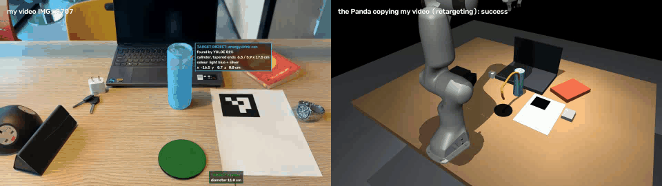
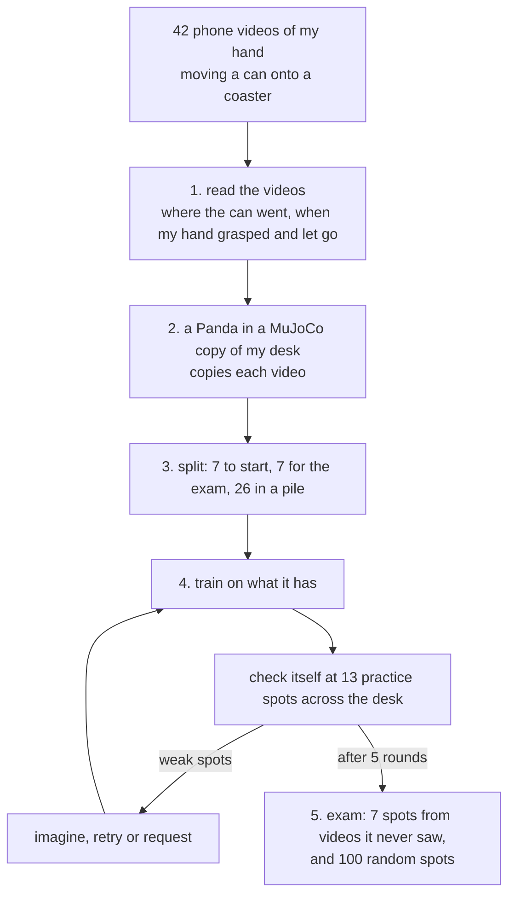
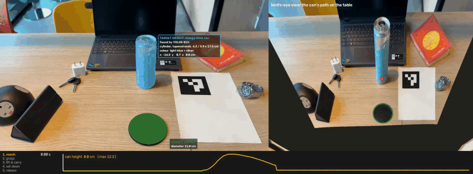
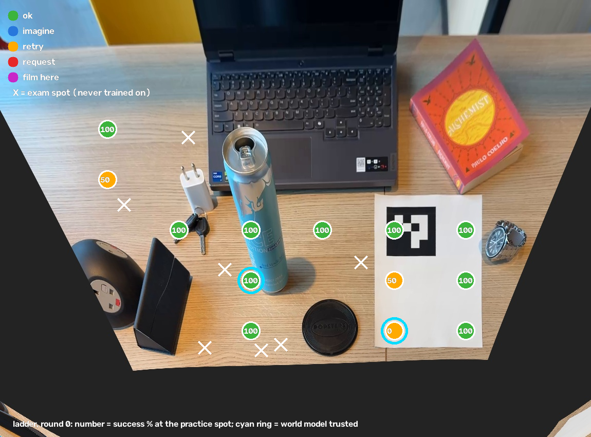
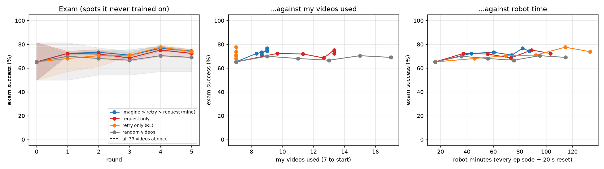
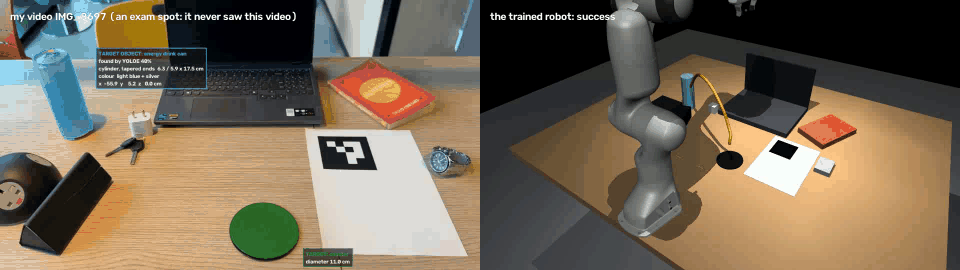
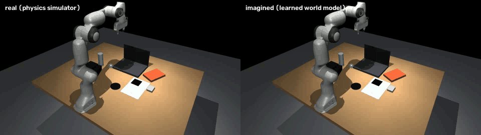

# Request or Retry

**A robot arm learns to put a can on a coaster from my phone videos. It starts with 7 videos, checks itself at 13
practice spots across the desk, and fixes each weak spot with the cheapest help that works: imagine it (free),
practise it (robot time), or ask me for one more video (my time).**



| exam: 7 spots from videos it never saw (70 tries, average of 3 runs) | success | my videos used | robot minutes |
|---|---|---|---|
| **my robot: imagine → retry → request** | **74%** | **9** | **87** |
| always ask for a video | 72% | 13.3 | 103 |
| always practise | 74% | 7 | 133 |
| all 33 videos up front, trained once (no asking, no practice) | 78% | 33 | about 75 |

- **success:** the can ends upright on the coaster, the gripper has let go, and nothing else on the desk was touched.
- **my videos used:** the 7 it starts with, plus the ones it asked me for.
- **robot minutes:** how long the arm is busy: turning each video into robot demos, checking itself and practising,
  plus 20 s to put the can back after every attempt.

Mine gets 74%, close to the 78% from all 33 videos, while using only 9 of them. Practising alone also gets 74%, but
takes 133 robot minutes to my 87. At 100 random spots on the desk, my robot succeeds 96% of the time, and 97% when it
finds the can with its own camera (see [Anywhere on the desk](#anywhere-on-the-desk)).

## The idea

A robot can learn a task from videos of a person doing it. But every video costs the person's time, and every practice
attempt costs the robot's time (and someone has to put the can back). So instead of collecting many videos up front, I
give the robot a few, let it find out where on the desk it still fails, and let it pick the cheapest help for each
weak spot:

| | help | cost | used when |
|---|---|---|---|
| 1 | **imagine**: practise in its head. It replays the closest video it already has, moved to start at this spot, inside the world model it learned, and trains on it if the model predicts success | nothing | the world model has already been right at that spot |
| 2 | **retry**: practise with the arm. Once with the closest video it already has, moved to start at this spot, and 5 times with its own policy; it learns from the attempts that worked | robot time | it has something to build on: one of the videos it already has starts within 10 cm, or it already succeeds there sometimes |
| 3 | **request**: ask me for a new video, one that starts near this spot | my time | nothing to build on, or practice didn't work |

Retry and imagine only re-use videos the robot already has. A request is the only way it gets a new one.

## How it works



### Step 1. Read my videos

`calibrate_camera.py`, `read_demos.py`



- **Real centimetres.** The phone is calibrated with a checkerboard video, and a paper marker (ArUco) on the desk
  gives the desk's coordinates. The phone's position is measured again in every clip, so a bumped phone doesn't matter.
- **The can.** YOLOE finds it by name ("energy drink can") in the first frame. SAM 2 then follows its outline in every
  frame (blue), even when my hand covers part of it.
- **My hand.** MediaPipe tracks 21 points on my hand in every frame (pink). The hand is cut out of the can's outline
  before measuring.
- **The coaster** is found by its round shape in a bird's-eye view of the desk (green ring). The other objects on the
  desk are measured in the same view.
- **The 3D path.** While the can stands on the desk, its position comes from where it touches the desk. While it's
  carried, it comes from a real-size can model fitted to its outline. The two agree within 0.1–2.4 cm at rest.
- **The moments.** From my hand and the can's motion: when I grasp, lift, set down and let go.

40 of my 42 videos are usable. IMG_8715 never really moves the can, and IMG_8700's measurement failed its own check.

**How each measurement is used:**

| from my videos | used for |
|---|---|
| where the can starts | where the can is put in the simulator; which video the robot gets when it asks; the exam spots |
| the can's 3D path | the path the robot carries the can along |
| when my hand grasps and lets go | when the gripper closes and opens |
| the coaster | where the can has to end up: the reward |
| the other objects | obstacles in the simulator: touching one makes the attempt fail |
| where my phone was | a camera in the simulator at the same place, for the side-by-side videos |

The can's size comes from a ruler, not the videos. The can in the simulator has my can's light blue, which is how the
robot's own camera finds it.

### Step 2. The robot copies each video

`twin.py`, `retarget.py`

- **The desk.** A MuJoCo copy of my desk: the coaster, laptop, book and the other objects are where my videos show
  them, and a Franka Panda (from MuJoCo Menagerie) stands where I sat. A camera in MuJoCo sits where my phone was.
- **From my hand: when. From the can: where.** The 21 points on my hand tell the robot when I grasped and when I let
  go; the can's path tells it where to carry the can. What it doesn't copy is my hand's shape: a two-finger gripper
  can't use my fingers and wrist, so it always grasps from the top, at the same height on the can. So it reaches the
  can where it stood, closes when my hand closed, carries it along my path with my timing (1.5× slower), sets it down
  where I did and lets go.
- **A safety margin.** My hand passed just over the desk hub and the glasses case because I could see them. The robot
  can't, so wherever my path goes over an object it carries the can at least 2 cm above it.
- **Result.** 39 of my 40 videos become robot demos. IMG_8710 starts so close to the robot's base that its elbow hits
  its limit. Each video gives 4 demos: an exact copy, and three with small random pushes along the way, so the robot
  also sees how to get back on track.
- **A different robot position** (the brief's "challenging embodiments"). The same robot standing at the right side
  of the desk (`retarget.py --base 0.35 -0.10`) can copy only 23 of the 40 videos: the far-left ones are out of its
  reach. Which of my videos are useful depends on the robot's body and where it stands.

`python watch.py IMG_8682 --copy --viewer` plays a copy live in the MuJoCo window, with my path in yellow and the
robot's in green.

### Step 3. Split the videos

`make_splits.py`

| group | videos | |
|---|---|---|
| start | 7 | what the robot starts with. I picked them at random; two more runs start from 7 drawn at random by the code |
| exam | 7 | never used for training. Chosen automatically to cover the desk |
| pile | 26 | the robot gets one only by asking for it |
| left out | 2 | see step 1 |

**Why a pile.** In real life I would film a new video when the robot asks. To keep the experiment repeatable I filmed
all of them in advance. A request gets the pile video whose can starts closest to the weak spot, if one starts within
10 cm; otherwise the robot writes the spot down as "film here" (where a new video is needed) and practises instead.
Every method draws from the same pile, so the comparison is fair.

### Step 4. Learn, check itself, and get help

`policy.py`, `agent.py`, `world_model.py`, `experiment.py`

**The policy** is a diffusion policy (a small network: 3 layers of 256), trained from scratch. It sees where the can
and the coaster are relative to its gripper, and how far its fingers are open, and plans its next 8 moves. It never
sees where on the desk it is, so it can't memorise spots.

**Each round** (5 rounds):
1. Train the policy on everything it has: the robot demos from its videos, and its own attempts that worked
   (practised or imagined). Round 0 starts from scratch; later rounds keep training the same network.
2. Check itself at 13 practice spots spread over the desk, 2 tries each, with the can nudged by about 1 cm. These are
   its own checks; the exam spots are kept away from them.
3. Take its weakest spots (up to 4, only those below 100%) and fix each with the cheapest help that works: imagine,
   retry, request (see The idea). Where it already succeeds, it asks for nothing.
4. Update the world model on everything the arm has really done, draw a map of the round, and start the next one.

**Costs** are counted the same way for every method:
- **my time:** each video I filmed costs about 30 s of my time, from the gaps between my recordings
- **robot time:** every real attempt (turning a video into robot demos, a self-check, a practice attempt), plus 20 s
  for someone to put the can back

Where the world model has proven right and the robot already succeeds, it also checks itself in its head instead of
with the arm, for free.

 

*The first and the last round of my run. Each circle is a practice spot, with its success % inside. Green: fine.
Blue: imagined. Orange: practised. Red: asked for a video. Purple: no video close enough ("film here"). Cyan ring:
the world model is trusted there. X: exam spot. In my run every fix was practice; the two runs that start from random
videos also imagined and asked.*

### Step 5. The exam

`experiment.py`, `evaluate.py`, `desk_test.py`

- **7 exam spots:** where the cans start in the 7 exam videos, which the robot never sees. 10 tries at each, with the
  can nudged by about 1 cm each time: 70 tries.
- **100 random spots** anywhere in the area where my videos start, not on the coaster and not on or touching another
  object. One try each, and a second time with the robot **finding the can with its own camera** at every decision
  (a colour + depth camera across the desk that picks out the light-blue can) instead of being told where it is. The
  coaster never moves, so its position is known.
- **A try counts only if** the can ends upright on the coaster, the gripper has let go, and nothing else on the desk
  was touched, by the arm or by the can. My path isn't compared: any path is fine.
- The exam is only measured, never used to decide anything. It is separate from the robot's own checks at the 13
  practice spots.

## Results

| on the 7 exam spots (70 tries; average of 3 runs) | success | my videos used | robot minutes |
|---|---|---|---|
| start: 7 videos, no help | 65% | 7 | 16 |
| **imagine → retry → request (mine)** | **74%** | **9** | **87** |
| always ask for a video | 72% | 13.3 | 103 |
| always practise | 74% | 7 | 133 |
| 2 random videos per round | 69% | 17 | 115 |
| all 33 videos up front, trained once | 78% | 33 | about 75 |

- **Mine ties for the best score of the methods that learn round by round, with the least robot time.** Always
  practising matched it, but needed 53% more robot time to save 2 videos. Always asking needed 6.3 extra videos
  instead of 2, and still ended lower.
- **It gets within 4 points of all 33 videos up front**, with 9.
- **It asks only when practice can't fix a spot.** Starting from my 7 videos it never asked: practising fixed every
  weak spot. Starting from the two random sets of 7, it asked for 3 videos each.
- **Most of the robot time it saves comes from imagination.** It checked itself in its head 79 times instead of with
  the arm. Each check skips 2 real attempts, so that's about 90 robot minutes over the 3 runs, and those checks were
  right 97% of the time.
- Differences of a few points are within noise (210 tries per method).



**At a spot it never saw** (my video of that spot on the left; yellow is my path, green is the robot's):



### Anywhere on the desk


The robot tested here is the one from my run: it learned from my 7 videos and its own practice, and never needed to
ask for another video.

| 100 random spots on the desk, one try each | success |
|---|---|
| **my robot, finding the can with its own camera** | **97%** (its estimate of where the can is: 0.6 cm off on average) |
| my robot, told where the can is | 96% |
| all 33 videos up front, told where the can is | 97% |

- **It works almost anywhere on the desk, not just where my videos start.** 31 of the 100 spots are more than 10 cm
  from where any video it learned from starts, and it still succeeds at 90% of those.
- **Seeing the can for itself costs nothing here**: 97% against 96%, the same within one spot.
- **The few failures are scattered**, not in one area: tipped over, touched the book or the charger, missed the
  coaster.
- **Why higher than the exam's 74%?** The exam counts each of its 7 spots equally, and 2 of them are the two hardest
  places on the desk (see below). On its other 5 spots it also succeeds 97% of the time.

All three versions side by side: [results/desk_map_compare.png](results/desk_map_compare.png).

### Where it fails, and why

| exam video | distance from the robot's base | start | mine | all videos |
|---|---|---|---|---|
| IMG_8697 | 63 cm | 93% | 100% | 93% |
| IMG_8684 | 31 cm | 63% | 93% | 100% |
| IMG_8693 | 71 cm | 100% | 100% | 100% |
| IMG_8689 | 47 cm | 70% | 97% | 100% |
| IMG_8694 | 28 cm | 0% | 17% | 30% |
| IMG_8704 | 44 cm | 90% | 97% | 100% |
| IMG_8710 | 27 cm | 40% | 17% | 20% |

- **On 5 of the 7 spots it succeeds 97% of the time.**
- **The two failures are the spots right next to the robot's base.** None of the videos it can learn from starts that
  close; the closest is 32 cm away. At IMG_8710 the robot can't even copy my own video, because its elbow hits its
  limit. Every method fails there most of the time, even with all 33 videos.

More in [results/evaluation.md](results/evaluation.md):
- at the 7 spots it learned from, it succeeds 100% of the time, and its can stays 1.7 cm from my path on average
- finding the can with its own camera instead of being told where it is, it succeeds 71% of the time (76% when told);
  its estimate of where the can is is 0.6 cm off on average

## The world model

`world_model.py`

Every real attempt costs robot time and someone resetting the can. The world model lets the robot predict the result
instead. It is five small networks that predict the next 0.1 s (where the gripper, the fingers and the can will be)
from the current state and the move. They learn only from what the arm has really done so far: the robot demos made
from my videos, its self-checks and its practice. They are retrained every round, and nothing is pretrained.

| tested on attempts it never saw | |
|---|---|
| reward predicted correctly | 83% (87% where it has earned trust, 80% elsewhere) |
| can position error, 1 s and 2 s ahead, with no correction | 0.3 cm and 0.4 cm |
| self-checks done in its head instead of with the arm | 79, right 97% of the time |
| imagined demos it trained on | 4, all of which really worked in physics |

**Trust** is measured spot by spot. The model is trusted at a spot only after it predicted every real attempt there
correctly. The model can't see the objects on the desk, so trust is what stops the robot relying on it near them.



## Speed

`speed.py`

The final policy from my run (76% on the exam), run different ways on the same 70 exam tries:

| | network passes per decision | ms per decision (CPU) | exam |
|---|---|---|---|
| diffusion, standard (DDPM, 100 steps) | 100 | 6.04 | 73% |
| diffusion, DDIM 10 steps | 10 | 0.39 | 76% |
| **diffusion, DDIM 4 steps (what the robot uses)** | 4 | **0.16 (37× faster)** | **76%** |
| a student distilled into 1 pass | 1 | 0.01 (519× faster) | 41% |
| behaviour cloning on the same data | 3 | 0.04 | 46% |

The policy predicts clean moves rather than noise, which is what keeps 4 steps as good as 100. The one-pass student is
fast but blurs the moments that matter most: closing and letting go.

## How this answers the brief

| the brief | here |
|---|---|
| your own data drives a robot arm in a simple simulator | 42 phone videos → the can's path and my grasp and release → a Panda in a MuJoCo copy of my desk |
| VLA and/or world models | a world model that predicts the robot's future, with trust measured spot by spot, used to test and train the robot without the arm |
| post-train a policy on your data | my own small policy, trained from scratch on robot demos made from my videos, then trained further every round on the new data it collects. No large pretrained model (see "Why not SmolVLA?") |
| creative retargeting, challenging embodiments | the robot copies the can's path and my hand's timing, not my hand's shape, with a safety margin; standing at the right side of the desk it can copy only 23 of my 40 videos |
| bootstrap a policy, then RL | starts from 7 videos; practice keeps the attempts that earned reward 1 |
| world modelling: video/state prediction | state prediction, rendered as video (imagined vs real) |
| optimise a policy to run faster | 37× faster with the same success |

**Beyond the brief: the research questions it touches.**

| research area | here |
|---|---|
| world models as learned simulators: scoring policies offline, synthetic rollouts for training | the robot checks itself inside its world model instead of with the arm (79 times), and trains on imagined demos where the model predicts success |
| fidelity metrics for where a world model can be trusted | trust measured spot by spot; trusted spots are predicted right 87% of the time, the others 80% |
| the embodiment gap between human and robot data, data attribution | my hand's videos become robot demos: where the can went, and when my hand grasped and let go; the robot decides which new data it needs, and where |
| inference and optimisation | the same policy 37× faster with the same success |
| RL and manipulation tasks in MuJoCo | a MuJoCo copy of my desk with a 0/1 reward, and practice that keeps the attempts that earned it |

**The task as an RL problem.**
- **State:** the gripper's position, the can's position, and the fingers.
- **Action:** a move of up to 2.5 cm and open or close, 10 times a second.
- **Reward:** 1 if the can ends upright on the coaster, released, with nothing else touched; 0 otherwise.
- **Learning:** practice explores with the policy's own randomness, and the attempts with reward 1 are added to its
  training data. With a 0/1 reward this is filtered behaviour cloning, the simplest form of reward-weighted regression.
- **Environment:** `twin.py` has `reset()` and `step()` like a Gym environment.

## What worked, what didn't

**Worked**
- Copying the can's path and my hand's timing, not my hand's shape: 39 of 40 videos become robot demos.
- The safety margin. In the run without it, the carried can touched objects in 4 of 35 exam tries and 6 videos couldn't
  be used; my robot scored 59%. With it: no touches, 74%.
- Practice: the robot's own successful attempts helped as much as extra videos, without costing my time.
- The world model's checks in its head: about 90 robot minutes saved over the 3 runs, right 97% of the time.
- The diffusion policy: 76%, against 46% for plain behaviour cloning on the same data.

**Didn't**
- Plain behaviour cloning. It copied its own last gripper command and never closed, and it blurred the grasp and the
  release. Removing that input, sampling those moments 10× more often and planning 8 moves ahead helped, but it stayed
  far behind.
- The one-pass student (41%).
- Predicting noise instead of clean moves: with 4 steps the moves were 12 mm off instead of 4 mm.
- The two spots next to the robot's base. None of the videos it can learn from starts that close.
- My first version counted only the arm touching objects, and every run started from my 7. All methods ended at 70–72%
  and looked the same. The stricter test showed what was really going on, and the safety margin fixed it.

## Questions I'd ask

**Why not train on all the videos?** Every video costs someone's time; the point is to need as few as possible and to
know which one to ask for. All 33 up front gives 78%; mine reaches 74% with 9.

**Does it learn, or memorise?** The policy only sees positions relative to its gripper, never where on the desk it is.
It is tested on 7 spots from videos it never saw and on 100 random spots, and is never trained there. At the random
spots more than 10 cm from any video it learned from, it still succeeds 90% of the time.

**Why does it not ask for videos of every unexplored area?** It checks itself at 13 practice spots across the desk
every round. Where it already succeeds, a new video would cost my time for nothing, so it only asks where it fails and
practising can't fix it.

**What if it fails halfway, while carrying the can?** Any failure counts against the spot where the can started, and
the reason is saved ("touched the laptop", "tipped over", "missed the coaster"). That spot then gets help like any
other.

**Does the exam check that the robot follows my path?** No. Any path is fine, as long as the can ends on the coaster
and nothing else is touched.

**Isn't the safety margin making things easy?** It changes how my videos become robot demos, not the test. The exam
has the same spots and rules with and without it, and the robot still has to learn to lift the can over objects at
spots it has never seen.

**Is this idea new?** The pieces aren't. The closest work I know is Rigter, Lacerda & Hawes, where a robot chooses for
each attempt between asking a person to teleoperate it and acting on its own, to save human time. What's different
here: a free first rung (the world model, used only where it has proven right), help that comes as a phone video of my
hand rather than teleoperation, and counting both my time and robot time.

**Why not SmolVLA?** The brief asks for VLA and/or world models, and I chose world models. A VLA doesn't fit this
experiment, for two reasons:
- **It needs more data.** SmolVLA's guide recommends about 50 demonstrations and says 25 weren't enough. My robot
  starts from 7 videos on purpose.
- **It's too heavy to retrain every round.** My robot retrains its policy every round, 72 trainings across the
  experiment (4 methods × 3 runs × 6), and one standard SmolVLA fine-tune takes about 4 hours on a datacentre GPU.

The robot demos made from my videos are exactly the kind of data a VLA is fine-tuned on, so swapping one in, with
camera images rendered from the copy of my desk, is the natural next step.

**Why not PPO?** Every attempt costs 30–45 s of robot time with the reset, so a whole run has only about 150 real
attempts. Policy-gradient fine-tuning needs far more than that; keeping the successes is simple, stable and cheap.

## Run it from A to Z

**1. Code, robot model and environment** (tested on Ubuntu with Python 3.14; a GPU only helps for reading the
videos):

```bash
git clone https://github.com/anspermiranda/request_or_retry_learning.git
cd request_or_retry_learning
git clone --depth 1 --filter=blob:none --sparse https://github.com/google-deepmind/mujoco_menagerie.git
(cd mujoco_menagerie && git sparse-checkout set franka_emika_panda)
python3 -m venv .venv
source .venv/bin/activate
pip install -r requirements.txt
```

**2. Watch the trained robot straight away.** The measurements from my videos (`out/`) and the trained policies
(`results/*.pkl`) are in the repository. My path is drawn in yellow, the robot's in green:

```bash
python watch.py IMG_8697 --viewer   # an exam spot: live in the MuJoCo window, then my video next to the robot
python watch.py --exam              # all 7 exam spots
python watch.py --train             # the 7 spots it started learning from
python watch.py IMG_8682 --copy     # the robot copying my video directly
python watch.py IMG_8697 --eye      # the robot finding the can with its own camera
```

The videos themselves are too big for the repository, so the left side stays grey until you download them (step 3).

**3. Download my videos** (42 clips and the checkerboard video) from the
[dataset release](https://github.com/anspermiranda/request_or_retry_learning/releases/tag/dataset-v1):

```bash
mkdir -p data/demos data/calibration
for i in $(seq 8682 8723); do
  curl -L -o data/demos/IMG_$i.MOV https://github.com/anspermiranda/request_or_retry_learning/releases/download/dataset-v1/IMG_$i.MOV
done
curl -L -o data/calibration/checkerboard.MOV https://github.com/anspermiranda/request_or_retry_learning/releases/download/dataset-v1/checkerboard.MOV
```

**4. Read the videos again** (optional: the results are already in `out/`). The YOLOE, SAM 2 and MediaPipe models
download themselves the first time.

```bash
python calibrate_camera.py data/calibration/checkerboard.MOV   # the phone's camera (calibration.json is included)
python read_demos.py data/demos                                # 42 videos -> out/<clip>/ (~2 h, faster with a GPU)
python collect_results.py                                      # a quality check per video -> out/results_table.csv
python make_splits.py --start IMG_8682 IMG_8688 IMG_8690 IMG_8703 IMG_8707 IMG_8718 IMG_8723   # -> data/splits.json
```

**5. Run everything else** with one command (about 1 hour on a 16-thread laptop):

```bash
bash run_all.sh
```

It runs these in order:

| command | what it does | writes |
|---|---|---|
| `python retarget.py` | the robot copies every video | `sim/`, the robot demos |
| `python retarget.py --base 0.35 -0.10` | the same, with the robot standing at the right side of the desk | `sim_base/` |
| `python experiment.py` | every method, 3 runs of 5 rounds (about 40 min) | `results/summary.json`, the maps, the curves, the trained policies |
| `python evaluate.py` | the final robot in detail, also with its own camera | `results/evaluation.md` |
| `python desk_test.py` | the final robot at 100 random spots | `results/desk_map.png`, `results/desk_test.json` |
| `python speed.py` | the same policy, run faster | `results/speed.json` |
| `python watch.py ... --save --no-window` | my video next to the robot | `results/watch_*.mp4` |
| `python make_gif.py ...` | the GIFs on this page | `docs/` |

## Files

| file | |
|---|---|
| `calibrate_camera.py` | the phone's camera, from a checkerboard video |
| `read_demos.py` | my videos → the can's 3D path, grasp and release, and the annotated videos |
| `collect_results.py` | one table of every video's measurements and quality checks (`out/results_table.csv`) |
| `make_splits.py` | start / exam / pile |
| `twin.py` | the copy of my desk, the Panda, and the task as an RL environment |
| `retarget.py` | my videos → robot demos, with the safety margin |
| `policy.py` | the diffusion policy, and behaviour cloning for comparison |
| `world_model.py` | the world model and where to trust it |
| `agent.py` | the robot that chooses imagine, retry or request |
| `experiment.py` | the comparison between the methods |
| `evaluate.py` | the exam in detail, including the robot's own camera |
| `desk_test.py` | the final robots at 100 random spots on the desk, also with the robot's own camera |
| `camera.py` | the robot's camera, drawn paths, side-by-side videos |
| `speed.py` | the same policy, faster |
| `watch.py` | my video next to the robot, and the live MuJoCo window |
| `make_gif.py` | GIFs for this page |

## Related work

- Diffusion Policy (Chi et al., 2023); DDIM (Song et al., 2021)
- ACT (Zhao et al., 2023): planning several moves at once
- DART (Laskey et al., 2017): small pushes during demonstrations
- MimicGen (Mandlekar et al., 2023): adapting a few demos to new object positions
- Reward-weighted regression (Peters & Schaal, 2007)
- Rigter, Lacerda & Hawes, A Framework for Learning from Demonstration with Minimal Human Effort: the closest idea to
  this one; ThriftyDAgger (Hoque et al., 2021): deciding when to ask a human for help
- PETS (Chua et al., 2018); MBPO (Janner et al., 2019): ensembles of learned world models
- YOLOE, SAM 2 and MediaPipe for reading the videos; MuJoCo, MuJoCo Menagerie and mink for the simulation
